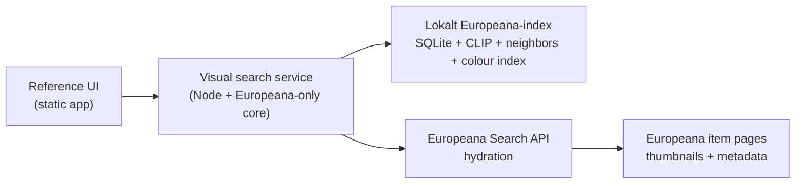
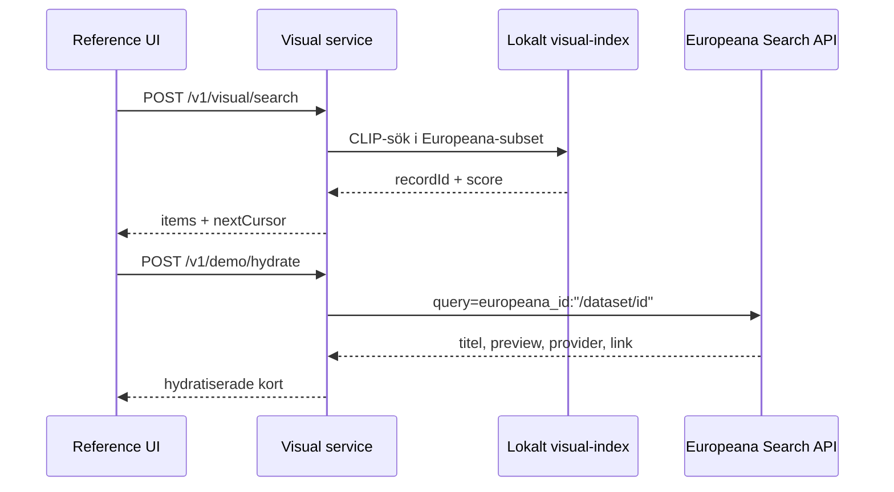

# Europeana visual extraction demo

Det här paketet visar att visual-söket går att bryta ut från Kabinett och köras som två separata artefakter:

- en fristående visual search service
- en tunn reference UI

## Arkitektur



## Request flow



## Demo scope

- Scope är Europeana-only från början till slut.
- `search` och `similar` körs mot det lokala Europeana-index som redan finns i demo-databasen.
- `color` använder vårt lokala dominant-colour-index för Europeana-demoindexet.
- UI:t visar tre flöden:
  - text till bild
  - liknande verk från en vald eller slumpad referensbild
  - färgmatchning
- Resultatkort hydratiseras via en demo-only endpoint baserat på `recordId`, inte från Kabinetts UI-payloads.
- Publik demo kör UI och API bakom samma domän, där UI:t anropar `/api/*`.

## Production scope

- Full produktion börjar först om Europeana vill gå vidare efter demon.
- Embeddings, ANN-index och batchjobb flyttas då till Europeana-ägd infrastruktur.
- Full skala betyder inte blint alla 60 miljoner records.
  Det betyder alla Europeana-records med användbar visuell media.
- Stor ingest ska byggas på FTP/OAI-PMH och IIIF/web resources, inte på vanlig Search API-crawling.
- Multi-image records ska indexeras på web-resource-nivå och deduperas tillbaka till record-nivå i svaren.

## Körning

### Visual service

```bash
cd apps/europeana-visual-service
npm run start
```

### Reference UI

```bash
cd apps/europeana-reference-ui
npm run start
```

Standardadresser:

- service: `http://localhost:4318`
- UI: `http://localhost:4320`
- UI-proxy: `http://localhost:4320/api/*`
